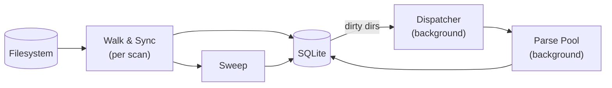

# byom

Status: proof of concept. Currently exploratory / architecture validation code.

## How it works

- `storages` - a root filesystem to scan (e.g. a music library path).
- `scans` - one run of the walker over a storage, tagged with a monotonically increasing `generation` counter.
- `dirs` - every directory seen during any scan, keyed by `(storage_id, relpath)`. Tracks `seen_generation` (last scan that visited it), mark/sweep status (`missing` flag), and a separate `dirty` flag + `locked_generation` (parse queue management / parse lock).
- `files` - files within a dir.

## Pipeline

1. Walker produces one `walkResult` per directory (post-order, with disc-folder merging via `discMerger`).
2. Sync pool (N workers, scan-scoped) diffs each dir against known DB state and calls `SyncDir` synchronously. This makes `syncPool.Wait()` a drain barrier before `Sweep` runs.
3. Sweep marks anything not seen in the current generation `missing`.
4. ParseDispatcher (process-scoped) polls for `dirty` dirs, claims them (`dirty=0`, `locked_generation=seen_generation`), and feeds a parser pool. Completion releases the lock.
5. Parser pool loads a dirty dir, extracts audio metadata, and then builds albums/tracks/artists (browsable library).
